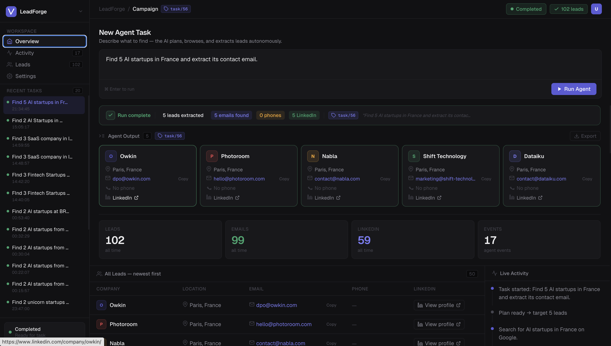

LeadForge AI

An autonomous, production-grade AI agent that plans, browses the web, and extracts high-quality lead data (emails, phones, LinkedIn profiles) in real-time. Built to replace manual prospecting and static, outdated databases.

 *(Note: Add a screenshot of your beautiful dark-mode UI here!)*

## 🚀 The Vision
Traditional lead generation requires either paying for expensive, outdated databases or spending hours manually scraping Google and LinkedIn. 

LeadForge AI solves this by deploying a live, autonomous web agent. You provide a natural language prompt (e.g., *"Find 5 AI startups in Germany"*), and the system dynamically builds a search plan, physically browses the internet, extracts structured contact data, and streams the live activity back to a modern React dashboard.

## ✨ Key Features

* **Autonomous Web Browsing:** Powered by the TinyFish API, the agent actually navigates websites, reads 'About' and 'Contact' pages, and extracts data exactly like a human would.
* **Smart LLM Planning:** Uses Gemini 2.5 Flash to classify queries, generate optimized search strings, and extract JSON data cleanly from raw HTML.
* **Real-Time Activity Streaming:** Watch the agent's thought process and browsing actions live in the UI via Server-Sent Events (SSE).
* **Self-Healing Fallbacks:** Automatically detects "unrealistic" queries (e.g., "Find an AI startup from 1800") and intelligently pivots to finding modern equivalents while warning the user.
* **Strict Deduplication:** PostgreSQL/SQLite database integration ensures you never save or see the same lead twice using prompt-injected blacklisting.
* **One-Click Export:** Instantly export task-specific or filtered leads to CSV and XLSX.

##  Tech Stack

**Backend:**
* Python / Django
* Django REST Framework
* Google GenAI SDK (Gemini 2.5 Flash)
* TinyFish Web Agent API (Requests & SSE)
* SQLite / PostgreSQL

**Frontend:**
* React.js (Hooks, Context)
* Custom CSS (Modern Dark UI)